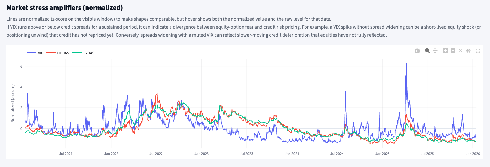
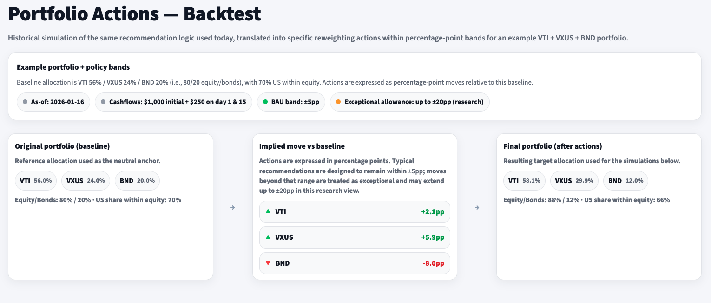

# Bogle & AI Bubble — A Deterministic, Data-Driven Allocation Companion

This repository contains **Bogle & AI Bubble**, a Streamlit dashboard that consolidates a broad set of market and macro diagnostics into a **deterministic** (rule-based) framework that produces **banded, Bogle-compatible allocation suggestions** for a simple ETF baseline (**VTI + VXUS + BND**).

The goal is **not market timing** and not “beating the market with predictions”. Instead, it is a structured way to:
- continuously monitor a high-uncertainty environment (including a potential AI-cycle bubble),
- translate multiple indicators into **transparent, repeatable** portfolio guardrails,
- and validate the practical impact of these guardrails via a historical “what-if” backtest under DCA.

This project intentionally prioritizes **product thinking** over “complexity for its own sake”:

- The system is **inspectable**: deterministic rules, explicit drivers, clear persistence logic, and documented limitations.
- It converts a broad and messy set of signals into **practical outputs**: banded recommendations, a consistent narrative, and a backtest-based sanity check.
- It demonstrates an end-to-end workflow: data ingestion → state building → automated refresh → UI delivery.

In many real settings, the hard part is not “adding ML,” but **defining the problem correctly**, building the right guardrails, and communicating outputs responsibly.

> **Disclaimer (baseline design date):** the full approach, thresholds, and deterministic rules were designed in **January 2026**. The system is intended to refresh inputs daily. However, if a structural break occurs (especially around an AI-cycle unwind), note that **the rules remain those defined in January 2026**, while only the **inputs** are updated.

---

## 🔗 Live Demo

**👉 Streamlit App:** https://bogleai-bubble-3gnctcftcpciv3izgvssyt.streamlit.app/

> ⚠️ The app may occasionally appear inactive due to Streamlit Cloud sleeping from inactivity.  
> Unlike one-shot demos, this project runs **daily data sync**, so it is likely to be awake most of the time.  
> If you ever find it asleep and want it woken up quickly, contact: **alexbmeist@gmail.com**

---

## What This Project Is (and Is Not)

- ✅ **A deterministic decision layer** built on many inputs, producing explainable recommendations.
- ✅ **A portfolio- and product-thinking exercise**: prioritizes clarity, correctness, and operational realism over adding complexity.
- ✅ **A “monitor + guardrails” system**: helps a Bogle-style investor decide when additional attention is warranted.
- ❌ **Not investment advice**.
- ❌ **Not a forecasting engine** (no return prediction; no regime predictions).
- ❌ **Not a claim of persistent outperformance** (the backtest explicitly shows long horizons remain hard to beat).

---

## App Walkthrough (Visual Preview)

The screenshots below walk through the app in the same order a user would typically consume it: **Home → Daily Snapshot → AI Bubble Diagnostics → Portfolio Actions & Backtest → Resources**.

### Screenshot 1 — Home (navigation + what each tab is for)


This is the entrypoint (“Home”). It presents the four building blocks:

1) **Daily Snapshot**: the **primary recommendation layer**. It summarizes the current state, the stability of signals (persistence), and the resulting allocation posture.  
2) **AI Bubble Diagnostics**: a focused set of fragility indicators for the AI-cycle. These are **secondary insights** that can reinforce (or challenge) the guardrails implied by the Daily Snapshot.  
3) **Portfolio Actions & Backtest**: converts the recommendations into explicit reweighting targets for a **VTI/VXUS/BND** portfolio and simulates how those actions would have played out historically under a realistic DCA schedule.  
4) **Resources**: supporting reading that answers “why” questions: why the actionables are Bogle-compatible (not market timing), why current conditions can justify increased vigilance, and deeper technical documentation for those who want to audit assumptions and limitations.

---

### Screenshot 2 — Daily Snapshot (current posture + persisted signals)


This tab is the **main “today view”**. It provides:

- **As-of date** (the effective date of the state).
- **Overall posture** (a compact summary like “risk-on within band”).
- **Trades suggested** (high-level guidance, still framed as **banded** and conservative).

The key design principle is that recommendations should not flip based on day-to-day noise.  
Signals are computed daily but **applied only if they persist** (see the deterministic logic section below).

---

### Screenshot 3 — Daily Snapshot (stress regime + driver decomposition)


This section explains *why* the posture is what it is. It summarizes:
- **Market stress regime** (e.g., Low Stress) as a normalized, interpretable gauge,
- and the **top contributing drivers** behind that stress score (e.g., spreads, VIX, financial conditions).

This is not meant as “prediction”. It is a **diagnostic layer**: when stress rises materially, the same allocation move becomes more defensible because downside asymmetry increases.

---

### Screenshot 4 — AI Bubble Diagnostics (bubble score + crash risk amplification)


This tab focuses on AI-cycle froth and fragility. It typically shows two headline outputs:

- **AI Bubble Score**: a composite of leadership / concentration / run-up proxies (scaled 0–100).  
- **Crash Risk (Amplified)**: bubble score adjusted by stress and realized volatility (also 0–100).

Interpretation: a high bubble score with low stress may imply fragility without immediate pressure; a high bubble score **plus** elevated stress/vol can justify tighter guardrails (or stronger diversification nudges).

---

### Screenshot 5 — AI Bubble Diagnostics (expanded insights beyond the headline gauges)



This screenshot is an example of the *supporting plots* and diagnostics shown in the AI Bubble tab.  
The intent is to avoid a single-number dashboard: users can inspect multiple views (leadership, concentration, fragility proxies, stress overlays) that collectively explain what is driving the AI-cycle assessment.

---

### Screenshot 6 — Portfolio Actions & Backtest (turn signals into portfolio moves)



This tab “materializes” the recommendation stream into a **hypothetical portfolio**:

- Baseline is **VTI 56% / VXUS 24% / BND 20%**.
- The app computes the latest recommended target weights.
- The UI shows: **baseline → implied move vs baseline → final target**.

Crucially, moves are expressed in **percentage points** and framed as conservative by default (BAU bands), with an explicit “exceptional” allowance only in rare, high-conviction states (research view).

---

### Screenshot 7 — Historical simulations vs benchmark (full horizon view)


This plot answers: **“If I had followed these deterministic rules historically, under consistent DCA, what would have happened vs the market?”**

It compares several scenarios under identical contributions (DCA):
- **VT (buy & hold)** benchmark with DCA
- **Baseline 56/24/20 (no rebalancing)**
- **Signals (contrib-only, no sells)** (routes new contributions to underweights)
- **Signals (full rebalance; tax-advantaged)** (rebalance at contribution dates; frictionless assumption)

The design goal is explicitly to show that **long-horizon outperformance is not guaranteed** and often not present. The app frames this as evidence supporting Bogle-style robustness, while still allowing structured guardrails during unusual conditions.

---

### Screenshot 8 — Backtest zoom (example of “non-bullish / shock” behavior)


This zoom highlights a period where managed scenarios can look relatively better (e.g., during an acute drawdown).  
This is not presented as a cherry-picked claim; it is used to illustrate the product thesis:

- In strong bull regimes, differences often widen in favor of the simplest equity-heavy benchmark.  
- In stress / drawdown regimes, conservative guardrails can sometimes reduce downside and improve the path.  
- Whether that tradeoff is worth operational complexity depends on investor context and constraints.

---

## Data Inputs and Connectors

The dashboard relies on multiple sources. The goal is not to maximize the number of datasets, but to cover distinct “risk lenses” with minimal redundancy and clear interpretability.

More detail on indicators, definitions, and limitations is documented in:
- the **Resources** tab, and
- the technical markdowns under **`content/learn/`**.

### 1) Market prices (ETFs) — core portfolio and proxy set

**Source:** Tiingo (daily adjusted close).  
**Used for:**
- computing returns, rolling volatility, trend/momentum proxies,
- constructing comparative indicators (e.g., leadership proxies, equal-weight vs cap-weight relationships),
- running the historical backtest panels (prices + returns).

Typical tickers used include (not exhaustive):
- **Core portfolio:** `VTI`, `VXUS`, `BND`, benchmark `VT`
- **US equity / risk proxies:** `SPY`, `QQQ`, `RSP`, `XLK`, `SOXX`
- **Defensives / cash proxies:** `BIL`, `SHV`
- **Bond duration curve proxies:** `IEF`, `TLT`, `VGSH`, `VGIT`, `VGLT`
- **Inflation / commodities:** `TIP`, `SCHP`, `GLD`, `DBC`

### 2) Macro + financial conditions — stress / risk premia context

**Source:** FRED (Federal Reserve Economic Data).  
**Used for:**
- stress regime detection and stress amplification,
- yield curve shape and rate dynamics,
- credit spreads and financial conditions proxies.

Examples of series included (illustrative, based on what the pipeline fetches):
- **Credit spreads:** high yield OAS, investment grade OAS
- **Rates:** 3M, 5Y, 10Y, 30Y yields; real yields; breakeven inflation
- **Financial conditions indices / USD proxies:** NFCI, trade-weighted USD indices
- **Volatility:** VIX

### 3) IMF SDMX structures (large XML) — robust SDMX querying and metadata

**Source:** IMF SDMX Central.  
**Used for:**
- retrieving **SDMX structures** (DSD / codelists / dataflows) needed to query IMF datasets consistently,
- ensuring the pipeline can adapt to new codelist entries over time,
- reducing the fragility of SDMX calls by having a local structure cache.

The IMF structure files are large and are handled outside the normal git-tracked dataset folder. The app consumes downstream processed outputs, but the daily refresh pipeline uses these structures to keep macro inputs aligned.

### 4) SEC context (qualitative fundamentals / narrative context)

**Source:** SEC filings (with a required declared user-agent).  
**Used for:**
- optional context signals and narrative “heat” proxies that complement market-based diagnostics,
- not used as a strict trading signal, but as additional interpretability context under the AI-cycle framing.

---

## Deterministic Logic Used (high-level, but technically specific)

Everything in this system is intentionally **deterministic**: the same inputs produce the same outputs, and every transformation is auditable.

The implementation details are documented in the **Resources tab** and `content/learn/`, but below is an overview of the most relevant methodologies and why they matter.

### 1) Normalization strategy (comparability across heterogeneous signals)

Many inputs are on incomparable scales (yields vs spreads vs returns vs ratios). To make them composable:

- **Rolling z-scores** are used where “distance from a recent baseline” matters.  
  Example: take a signal $x_t$ and compute  
  
```math
z_t = (x_t - \mu_{t,w}) / \sigma_{t,w}
```
  
  for a window $w$, producing a unitless measure of “how extreme” the current value is relative to recent history.

- **Percentile mapping** is used where robustness to distribution shape matters (heavy tails, skew).  
  Example: map the current value to its empirical percentile within a rolling window, then scale to 0–100.  
  This is often more stable than z-scores when fat tails would otherwise overreact to a few outliers.

- **Clipped / winsorized transforms** are applied where extreme tails should not dominate composite scores.  
  This is a pragmatic step to keep composites interpretable and to avoid “one noisy input” overriding everything.

### 2) Composite score construction (multiple independent lenses, not a single proxy)

The system is explicitly designed so that recommendations are rarely driven by one indicator.

- **Stress composites** combine multiple stress-related series (volatility, spreads, financial conditions).  
- **AI-cycle composites** combine leadership / concentration / run-up proxies to avoid reducing “bubble risk” to a single valuation metric.

The key design constraint: **independence and interpretability**. If two inputs are highly redundant, they do not both get full weight in a composite.

### 3) Persistence / anti-flip filtering (reduce noise-driven actions)

Daily signals are noisy. A deterministic system that reacts instantly can become a “noise amplifier”.  
To prevent this, actions are gated by **persistence rules**:

- A signal is only “promoted” to an actionable direction if it appears consistently over a lookback window (e.g., appears at least **k out of N days**).
- This creates a clear tradeoff: slower reaction, but reduced churn and fewer false positives.

This is closer to “behavioral robustness engineering” than to forecasting.

### 4) Banding: actions expressed as constrained, implementable moves

Rather than outputting an unconstrained optimization result, the system produces **banded moves** around a baseline allocation.

- **BAU band** (business-as-usual): small changes intended as incremental robustness nudges.  
- **Exceptional allowance** (research view): larger moves permitted only under rare, high-conviction / high-severity states.

This is important because it forces the system to answer: “Is this signal strong enough to justify *operationally meaningful* action?”

### 5) Convex “extra term” beyond BAU (why larger moves become progressively harder)

One of the core design choices is that justification should not be linear with move size.

A +1pp move beyond BAU should be easier to justify than +10pp beyond BAU.  
To enforce that principle deterministically, the policy introduces a **convex penalty beyond the BAU band**.

Conceptually:
- Within BAU, the “cost” of moving is mild and roughly linear.
- Past BAU, an additional “extra term” grows **convexly**, discouraging aggressive moves unless multiple conditions align.

A common convex penalty family is quadratic (L2), e.g.:

```math
\text{penalty}(d) = 
\begin{cases}
0, & |d| \le b \\
\lambda (|d| - b)^2, & |d| > b
\end{cases}
```

where:
- $d$ is the move size (in percentage points),
- $b$ is the BAU band threshold,
- $\lambda$ controls how quickly “extra justification” grows.

Why this matters:
- It hard-codes the idea that **beyond-normal moves require disproportionately stronger evidence**.
- It prevents accidental “regime flips” from modest changes in noisy inputs.
- It is transparent: you can inspect exactly why an 8pp shift was rejected unless severity/persistence/stress all aligned.

### 6) Stress amplification (same signal, different risk asymmetry)

The system explicitly allows the same underlying signal to map to different allocation posture depending on stress.

Example intuition:
- If leadership is narrow but stress is low, guardrails remain conservative (don’t overreact).
- If leadership is narrow **and** stress/volatility are elevated, downside asymmetry increases, so the same crowding signal becomes more actionable.

This is not market timing; it is a deterministic way to encode **risk asymmetry** into action thresholds.

---

## Techniques Intentionally Not Used (and why)

This project could have been made far more “quant” or “ML-heavy”. That was explicitly avoided.  
Below are examples of techniques that are common in quant research, what they would be used for, and why they were intentionally excluded here.

### 1) Return forecasting models (supervised ML / time-series prediction)

**Examples (not used):**
- Gradient boosting regressors (XGBoost / LightGBM) predicting next-month returns.
- Deep learning sequence models (LSTM/Transformer) for return prediction.
- Elastic Net / LASSO predictive regressions on macro features.

**Why not used:**
- Return forecasting is fragile, highly regime-dependent, and easy to overfit.
- It would shift the product from “guardrails” to “prediction claims”.
- It would require careful walk-forward validation, feature stability analysis, and continuous model monitoring, which is intentionally out of scope.

### 2) Regime detection / hidden-state models (probabilistic market states)

**Examples (not used):**
- Hidden Markov Models (HMM) for bull/bear regime classification.
- Markov-switching models (Hamilton-style) with different volatility/mean states.
- Bayesian change-point detection.

**Why not used:**
- These models can be elegant but often produce regime labels that are hard to justify operationally.
- They can introduce “false certainty” (probabilities that look authoritative but are model-dependent).
- The current approach keeps regime logic explicit and interpretable via stress composites and persistence gating.

### 3) Factor modeling and attribution (Fama–French / Barra-style frameworks)

**Examples (not used):**
- **Fama–French Five-Factor (FF5)** regressions to attribute returns to market, size, value, profitability, investment factors.
- Momentum / quality / low-vol factor decompositions.
- Rolling factor exposure analysis for the portfolio and proxies.

**What they could add:**
- A decomposition explaining *why* the portfolio differed from benchmark over time (factor exposures).
- A way to detect when outperformance is just factor tilts (e.g., implicit momentum).

**Why not used:**
- Factor models add interpretability but also add a second “model layer” (estimation choices, factor definitions, rolling windows, instability).
- The app’s purpose is not performance attribution; it is decision guardrails under uncertainty.
- Keeping the logic deterministic and minimally assumption-heavy was prioritized.

### 4) Portfolio optimization frameworks (mean-variance, robust, Bayesian)

**Examples (not used):**
- Mean-variance optimization (Markowitz) with estimated expected returns and covariance.
- Robust optimization (worst-case bounds on returns/covariance).
- Bayesian portfolio models / Black–Litterman blending views with priors.

**Why not used:**
- Optimization outputs are extremely sensitive to return assumptions.
- This would force return “views”, which conflicts with the Bogle-compatible framing.
- Banding and convex penalties are intentionally simpler, more implementable, and easier to audit.

### 5) Dynamic strategies (vol targeting, risk parity, trend-following overlays)

**Examples (not used):**
- Volatility targeting (scale equity exposure inversely to realized volatility).
- Risk parity allocations (equalize risk contributions across assets).
- Explicit trend-following overlays (moving average crossovers as allocation switches).

**Why not used:**
- These can be effective but are often closer to tactical strategy design than to “Bogle-compatible guardrails”.
- They can materially increase turnover and complexity.
- The backtest already includes a frictionless “full rebalance” scenario; adding dynamic overlays would move the product goalposts.

### 6) Alternative data and sentiment modeling (news, social, options flows)

**Examples (not used):**
- NLP sentiment from news/social media (FinBERT, topic models).
- Options-implied positioning / dealer gamma exposure models.
- Flow-based crowding indicators beyond the price-based proxies.

**Why not used:**
- Data reliability and reproducibility are harder.
- Operational complexity increases sharply (rate limits, paid APIs, data vendor risk).
- The current proxy set aims for a stable, auditable baseline using widely available sources.

---

## Folder and File Structure (high-level)

```
root/
│
├── app/                          ← Streamlit app entrypoint + tabs
│   ├── Home.py
│   └── pages/
│       ├── 01_Daily_Snapshot.py
│       ├── 02_AI_Bubble_Diagnostics.py
│       ├── 03_Portfolio_Actions_Backtest.py
│       └── 04_Learn_Glossary.py   (shown as “Resources” in the UI)
│
├── scripts/                      ← Daily refresh + dataset build steps
├── data/                         ← Cached raw data + state outputs consumed by the app
├── content/learn/                ← Technical markdowns referenced in Resources
└── Screenshots/                  ← Visual walkthrough assets
```

---

## Summary

This project is an example of building a **data-driven product** where the highest leverage is not adding “more modeling”, but:

- selecting inputs that cover distinct risk lenses,
- transforming them into comparable scales (z-scores, percentiles, robust clipping),
- enforcing operational realism (persistence gating, banded actions),
- encoding rational conservatism (convex penalty beyond BAU),
- and validating the practical impact through a transparent backtest under DCA.

It is designed to be inspectable end-to-end: **every recommendation comes from deterministic rules** applied to updated inputs, with supporting documentation in the Resources tab and `content/learn/`.


---

## Contact

**Alex (Alexmmarin94)** — alexbmeist@gmail.com
